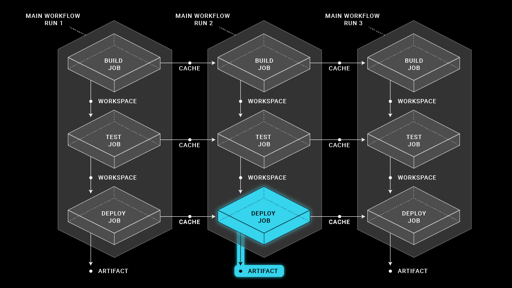
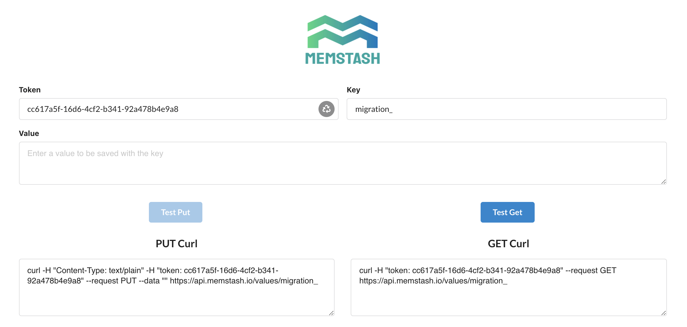
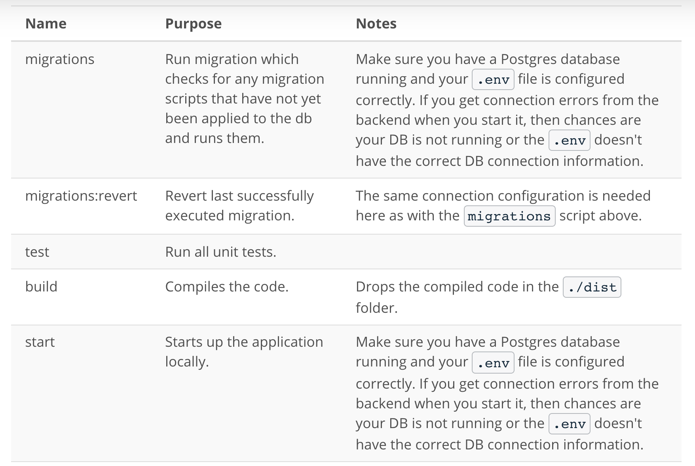

# Give your Application Auto-Deploy Superpowers

In this project, you will prove your mastery of the following learning objectives:

- Explain the fundamentals and benefits of CI/CD to achieve, build, and deploy automation for cloud-based software products.
- Utilize Deployment Strategies to design and build CI/CD pipelines that support Continuous Delivery processes.
- Utilize a configuration management tool to accomplish deployment to cloud-based servers.
- Surface critical server errors for diagnosis using centralized structured logging.


## Conceptual Overview of the Project

To help my understanding, I will present my conceptual understanding of the project.  What we are trying to do and how.

### Relevant Files

The majority of the CI/CD code that had to written for the project can be found in the `.circleci` folder. More specificially, all the relevant code can be found in the following files under the `.circleci` folder:

- **config.yml**: the main file that outline the CI/CD pipeline
- *files/cloudfront.yml* (given): File that deploys the initial infrastructure for production deployment on the CloudFront CDN service.  Cloudfront delivers content to user.  It is a content delivery service.

- *files/backend.yml*: Creates the EC2 instance that will serve the backend binary that runs the nodejs website.

- *files/frontend.yml*: Deploys the frontend infrastructure. The frontend will be served through an S3 bucket. So creates the bucket for where the frontend will be store. The s3bucket will be unique with the CIRCLE_WORKFLOW_ID.  So every new frontend will be stored in a different S3 bucket, so the url will change (based on the s3 bucket url). When promoting the new frontend, you are swapping this new url (green deployment) with the blue candidate that is currently in Cloudfront infrastructure.

- *ansible/configure-server.yml*: One of the main files for ansible. Installs python on the EC2 instance.  See the `configure-infrastructure` job in the *config.yml*. It also triggers the *configure-server role* and the *configure-prometheus-node-exporter role*.
  - *ansible/roles/configure-server/main.yml*: Installs `nodejs`, `npm`, and `pm2` on the EC2 instance.  Then starts the backend server using pm2.
  - *ansible/roles/configure-prometheus-node-exporter/tasks/main.yml*:  Installs node exporter and enables the prometheus node_exporter service.  Prometheus is a open source service that monitors applications and sends alerts when needed.

- *ansible/deploy-backend.yml*: Sets up the deploy role (also initiates ansible settings).
  - *ansible/roles/deploy/tasks/main.yml*: `Add description`

Note the actually code for the application that is being deployed is in the backend and frontend containers. The backend constructs the backend server using Nodejs.  The frontend (i.e., client GUI) is also created using Nodejs.  Also we are using a `blue-green deployment strategy`.  

### How the CICD pipeline is laid out by the config.yml file


To understand what this project is doing.  I am listing out jobs/steps in the pipeline (i.e., workflow), and trying to explain them. Note, each job is done within a container.  We specify the container to use.

``````

1. **Build Frontend**: Use this container to take the front end code and create the binary (computer readable version of the code) that will be executed. This requires installing dependencies, checking the code style fits expectation, and then finally creating the binary. To prevent constantly having to install the dependencies, after the first run of the workflow, all subsequent workflows will use the dependencies store in the cache.

2. **Build Backend**: Similar to build front end, but use this container to build (compile) the backend binary.  Want to make sure there is no syntax errors.

3. **Test Frontend**: Use this container to tests that the frontend scripts passes unit tests.  Want to make sure there are no logical errors.

4. **Test Backend**: Use this container to tests that the backend scripts passes unit tests. Want to make sure there are no logical errors.

5. **Scan Frontend**: Use this container to scan package dependencies (i.e., packages/modules/libraries) for the frontend scripts for security issues. It also fixes the most critical cases by forcing a package update.

6. **Scan Backend**: Use this container to scan package dependencies (i.e., packages/modules/libraries) for the backend scripts for security issues.It also fixes the most critical cases. It also fixes the most critical cases by forcing a package update.

7. **deploy infrastructure**: You are telling this container to use the cloudformation template (i.e., `backend.yml`) and generate the EC2 instance for where the backend application will be located.  Also create the S3 bucket, using the cloudformation template `frontend.yml`, where the frontend will be located. Create the inventory file that ansible use to understand which EC2 instances in your account to configure.  The inventory file is stored in the workspace so other jobs can access file. I also store the backend URL to memstash, so I can access this variable at any point.

8. **configure-infrastructure**: Goal is to run ansible in the container and tell let ansible ssh into the EC2 instances that you defined in the inventory.txt file.

9. **run-migration**: The container runs the database migration after configuring the .env file.  The goal is to get the environment settings that are stored in CircleCI interface and get them into the .env file of the migration container.  After the .env file is in the container's file system, Ansible needs to make the values in the .env file, environment variables within the EC2 instance. After that, Ansible starts the backend executables.

10. **deploy-frontend**: Container that moves frontend files to S3 bucket that will serve our green candidate website for deployment.

11. **deploy-backend**: Container that moves the final backend files to the EC2 instance that will serve as our green candidate for deployment.

12. **Smoke Test**: The goal is to check that the candidate application is on the internet and that you can connect to it.

13. **CloudFront Update**: Promote the candidate application replacement. Replace the blue candidate (aka. the application version currently running as the production application) with green candidate (updated application that just went through the CICD process).

14. **Clean up**:

### Saving Information in CircleCI



[Persisting Data in CircleCI](https://circleci.com/blog/persisting-data-in-workflows-when-to-use-caching-artifacts-and-workspaces/)

As the image shows:

- *Workspace*: are mutable (i.e., changeable) file storage for while the workflow is running.  Each job in the workflow can add (`persist_to_workspace`) *files* and retreive *files* (`attach_workspace`). When retrieving files, you can only access it files from jobs that occurred previously.

- *Cache*: are nonmutatble file storage that can be use between workflow runs.  It shares files saved in the same job (`save_cache`) but across different workflow runs. It is main used for storing packages or things you download for the purpose of running the application.  It makes it so the next time you run . To retrieve files (`restore_cache`).

- *artifacts*: If you want to store files, which were constructed inside of a workflow, outside of the workflow. You will be able to access the files through the CircleCI tool

- *environment variables*: You (the user), store key-pair values in the CIRCLECI interface to be used by the workflow.  You may store secrets or things you do not want to hard code into your code.  Secrets include ssh keys, database connection information, or login information.

- *secrets manager*: Secrets managers like Hashicorp vault, AWS secret manager, or memstash.io can be use to store environment variables or other variables. Note I said variable.  The CircleCI persist data all focus on saving files.  These secret manager securely store variables that you can save and retrieve while run a workflow or even running the application. This project uses memstash.io as its secrets manager example.
  
  - 
  - [Memstash.io url](memstash.io)
  - To use memstash.io you need to go to the url.  And copy the PUT curl code to save the data.  You can put in dummy data for the Key and Values.  The most important part is the unique token.  That is how it going to store and retieve the data.  After getting the PUT code, include it in your application or workflow.  To retrieve the value use the Get Curl code that memstash.io provides.

### Other Notes

Ran the cloudformation code with the following aws cli command:

```bash
aws cloudformation create-stack --profile udacity_project3 --stack-name uda-cloudfront-stack --template-body file://cloudfront.yml --region us-east-1 --capabilities "CAPABILITY_IAM" "CAPABILITY_NAMED_IAM"
```

In CircleCI an executor is related to what base operating system (MacOS, Linus, Window) the container is based on.

#### To SSH into Client

1. Open terminal
2. Run this command, if necessary, to ensure your key is not publicly viewable. `chmod 400 <key-file.cer/pem>`
3. In terminal enter the following: `ssh -i <key-file.cer or key-file.pem> <user>@<IP-address>` where user is the OS default user: (e.g, `ubuntu` for Linux Ubuntu OS, `ec2-user` for Amazon distributions. And IP-Address can be the ip-address or the dns url

#### To Ping a Remote Machine a certain amount of times

The following command pings the remote computer identified by the ip-address: 192.168.2.200, 5 times.  The -c option is the key.
`ping -c 5 192.168.2.200`

Determining how much info, if you add `-v` (you will get verbose information), but if you add `-q` you will get summary information (quiet mode). EX
`ping -c 5 -q 192.168.2.200 # Example of quiet mode ping`

#### To Test port function

Log into the machine and type `telnet localhost 3030`, for instance, if you are interested in testing port 3030.

#### Testing Backend and Promethesus Server infrastructure

```bash

  # Create EC2 instance for Backend 
  aws cloudformation create-stack --profile <profile_name> --stack-name test-backend-stack --template-body file://backend.yml --capabilities "CAPABILITY_IAM" "CAPABILITY_NAMED_IAM" --region=us-east-1

  # Create EC2 Instance for Prometheus Server
  aws cloudformation create-stack --profile <profile_name> --stack-name test-prometheus-stack --template-body file://prometheus_server.yml --capabilities "CAPABILITY_IAM" "CAPABILITY_NAMED_IAM" --region=us-east-1
```

### Random help links

- [AWS CLI S3 Command Reference](https://awscli.amazonaws.com/v2/documentation/api/latest/reference/s3/sync.html)
- [difference btw aws cp and aws sync:](https://stackoverflow.com/questions/64728076/aws-s3-cp-vs-aws-s3-sync-behavior-and-cost)
- [Ansible playbook command for targeting different groups in an inventory](https://docs.ansible.com/ansible/latest/cli/ansible-playbook.html)
- [Setting up a prometheus server on an EC2 instance](https://codewizardly.com/prometheus-on-aws-ec2-part1/)
- [Setting up Prometheus Service Discovery on AWS EC2](https://codewizardly.com/prometheus-on-aws-ec2-part3/)
- [How to use the vi editor on linux](https://staff.washington.edu/rells/R110/)
  - Had to use this command a lot to save: `:w !sudo tee %`, then type (L) load <https://stackoverflow.com/questions/14948441/vim-cant-save-file-e212/14948510>.  But if I use `sudo vi <filename>` you will not run into this issue.
- [SCP command for copying from local machine to EC2 instance](https://angus.readthedocs.io/en/2014/amazon/transfer-files-between-instance.html)
- [Installing Atom on Ubuntu linux machine](https://linuxize.com/post/how-to-install-atom-text-editor-on-ubuntu-20-04/)
- [Tar options](https://www.gnu.org/software/tar/manual/html_node/Option-Summary.html#Option-Summary)
- [All About Ping](https://www.redhat.com/sysadmin/ping-usage-basics)
- [Understanding the Linux `chown` command](https://phoenixnap.com/kb/linux-chown-command-with-examples)
- [Ansible Command Reference](https://docs.ansible.com/ansible/latest/collections/ansible/builtin/index.html).  For ansible you really need to look at collections.  Each collection has their own commands.
- [Linux Systemctl & systemd](https://www.digitalocean.com/community/tutorials/how-to-use-systemctl-to-manage-systemd-services-and-units)
  - `systemd` is an **init system** (*initialize services (aka. applications running in the background) that should start after a reboot of the linxus kernel*) and **system manager**. `systemctl` command is the central management tool for controlling the init system. The `prometheus.service` file is an example of an **unit file**. The `systemd` understands how to read the units within an unit file. Units are categorized by the type of resource they represent and they are defined with files known as unit files. The type of each unit can be inferred from the suffix on the end of the file.For service management tasks, the target unit will be service units, which have unit files with a suffix of .service. However, for most service management commands, you can actually leave off the .service suffix, as systemd is smart enough to know that you probably want to operate on a service when using service management commands.
  - starting and stoppint a service `sudo systemctl start application.service` or `sudo systemctl start application`.  The command format for systemctl is: `sudo systemctl <command> <application.service>`. Other commands to use with systemctl:
    - `stop`: stop a currently running service
    - `restart`: restart a service.  Usually do if you want the service to pick up a new configuration.
    - `reload`: if the application in question is able to reload its configuration files (without restarting), you can issue the reload command to initiate that process.
    - `reload-or-restart`: This will reload the configuration in-place if available. Otherwise, it will restart the service so the new configuration is picked up.
    - `enable`: to start a service at boot. This will create a symbolic link from the system’s copy of the service file (usually in /lib/systemd/system or /etc/systemd/system) into the location on disk where systemd looks for autostart files (usually /etc/systemd/system/some_target.target.wants . Keep in mind that enabling a service does not start it in the current session. If you wish to start the service and also enable it at boot, you will have to issue both the start and enable commands.
    - `disable`: to stop a service from running at boot. Removes the symbolic link that indicated that the service should be started automatically.
    - `status`: To check the status of a service on a system. This will provide you with the service state, the cgroup hierarchy, and the first few log lines.
      - `is-active`, `is-enabled`, `is-failed`, `is-disabled`. Are specific statuses that you want to check for.  EX: `sudo systemctl is-active application.service`.  It will return a 0 or 1.  However, you will need to look at each sub status to know what 0 and 1 means.  It is also in this reference url.
    - `list-units` : This will show you a list of all of the units that systemd currently has active on the system. Output:
      - UNIT: The systemd unit name
      - LOAD: Whether the unit’s configuration has been parsed by systemd. The configuration of loaded units is kept in memory.
      - ACTIVE: A summary state about whether the unit is active. This is usually a fairly basic way to tell if the unit has started successfully or not
      - SUB: This is a lower-level state that indicates more detailed information about the unit. This often varies by unit type, state, and the actual method in which the unit runs.
      - DESCRIPTION: A short textual description of what the unit is/does.

### Things to protect (SECURITY)

-**Webhooks** are secrets you are need to protect.  Same as **IP addresses** to your instances.  That is why, in this project we are using environment variables and memstash (or another feature store application) to store items that could be exploited.

---

## Instructions

- [Selling CI/CD](instructions/0-selling-cicd.md)
- [Getting Started](instructions/1-getting-started.md)
- [Deploying Working, Trustworthy Software](instructions/2-deploying-trustworthy-code.md)
- [Configuration Management](instructions/3-configuration-management.md)
- [Turn Errors into Sirens](instructions/4-turn-errors-into-sirens.md)

### Description

*Provided Cloud Formation Templates*
For your convenience, we have provided some CloudFormation templates that you can use throughout the deployment phase of your project. You can find those templates in `.circleci/files`.

#### Intentionally Failing Jobs

We left a scaffolded `config.yml` for you `.circleci/config.yml` to help you get started with CirlcCI's configuration. To call attention to unfinished jobs, we left some "non-zero error codes" (e.g. exit 1) for you to remove when you have finished implementing a job.

#### Compiling/Running Locally (Optional)

PLEASE NOTE: It is NOT necessary that you compile and run the project locally. The goal of this project is for you to show mastery in management of CI/CD systems, not React/NodeJS web applications. If you are experienced with React/NodeJS or don't mind an extra challenge, then be our guest! But, you can perfectly complete this project without compiling or running the code locally.

The instructions and information that follows should help you build, test and deploy the web application either locally or in CI/CD.

This is a "mono-repository" which means multiple servers or layers exist in the same repository. You'll find the following main folders:

- ./frontend
- ./backend

#### 1. Install dependencies in both frontend and backend folders

From your cdond-cd-projectstarter folder, use the commands:

  ```bash
    cd frontend
    npm i
  ```

  From your cdond-cd-projectstarter folder, use the commands:

  ```bash
    cd backend
    npm i
  ```

#### 2. Create .env file for database connection info

Add a .env file to your backend folder with the following contents:

```bash
  NODE_ENV=local
  VERSION=1
  TYPEORM_CONNECTION=postgres
  TYPEORM_MIGRATIONS_DIR=./src/migrations
  TYPEORM_ENTITIES=./src/modules/domain/**/*.entity.ts
  TYPEORM_MIGRATIONS=./src/migrations/*.ts

  # Things you can change if you wish...
  TYPEORM_HOST=localhost
  TYPEORM_PORT=5532
  TYPEORM_USERNAME=postgres
  TYPEORM_PASSWORD=password
  TYPEORM_DATABASE=glee
```

You can use your own Postgres server if you wish or you can use the Docker-Compose template we provided in the ./utils folder.

### Running PostgreSQL in Docker-Compose

For convenience, we have provided a template that you can use to easily run a Postgres database for local testing. To run this template, you'll need to install Docker and Docker-Compose.

To start the database, you will use the following commands from your cdond-cd-projectstarter folder:

```bash
  cd util
  docker-compose up
```

Compiling the Code
You can compile the code from your cdond-cd-projectstarter folder using the following:

```bash
  # frontend
  cd frontend
  npm run build

  # backend
  cd backend
  npm run build
```

**WARNING**: There are some errors in both front-end and back-end that will make any attempt to compile FAIL when you first clone the repo. These errors are intentional. There are steps in the project that require a build to break in Circle CI. Please don't fix these errors until instructed to do so later on.

### Testing, Migrating, Running

As the warning says above, it won't be possible to run most of the code in the project until later on when you are instructed to fix some errors. So, you may not be able to try the following commands right now. We are providing them here as a reference.

Most of the tasks needed to build, test and deploy the application are simplified by "npm scripts" that are found in the `package.json` for either front-end or back-end. For any of these scripts, you will need to `cd` into the respective folder and then run the script using the command `npm run [script name]`. Here are the most relevant scripts:



### Examples

This should compile the code and then list the result in the `./dist` folder:

```bash
  cd frontend
  npm run build
  cd dist
  ls
```

... or revert the last migration that ran:

```bash
  cd backend
  npm run migrations:revert
```

## Section 2 - Utilize Deployment Strategies to Design and Build CI/CD Pipelines that Support Continuous Delivery Processes

### Circle CI

Circle CI is only one of many options for CI/CD tools. It is a “software as a service” and has a free account that you can use throughout this project, which is ideal for UdaPeople since it’s a start-up running on a shoestring budget!

1. Create an account with circleci.com if you haven't already. We recommend the free tier for this course. It includes 2500 credits per week which equals around 70 builds. This should be enough as long as you are conservative with your builds. If you run out of credits, you can create another account and continue working.

2. Create a new project in Circle CI using your GitHub repo.
Notice the .circleci folder. This is where your jobs will go.

3. Ensure a workflow starts with the jobs in your `.config` file. If you need to take a look at some samples, Circle CI was nice enough to give us a few.

### Project Submission

For your submission, please submit the following:

- A text file named `urls.txt` including:
  1. Public Url to GitHub repository (not private) [URL01]
  1. Public URL for your S3 Bucket (aka, your green candidate front-end) [URL02]
  1. Public URL for your CloudFront distribution (aka, your blue production front-end) [URL03]
  1. Public URLs to deployed application back-end in EC2 [URL04]
  1. Public URL to your Prometheus Server [URL05]
- Your screenshots in JPG or PNG format, named using the screenshot number listed in the instructions. These screenshots should be included in your code repository in the root folder.
  1. Job failed because of compile errors. [SCREENSHOT01]
  1. Job failed because of unit tests. [SCREENSHOT02]
  1. Job that failed because of vulnerable packages. [SCREENSHOT03]
  1. An alert from one of your failed builds. [SCREENSHOT04]
  1. Appropriate job failure for infrastructure creation. [SCREENSHOT05]
  1. Appropriate job failure for the smoke test job. [SCREENSHOT06]
  1. Successful rollback after a failed smoke test. [SCREENSHOT07]  
  1. Successful promotion job. [SCREENSHOT08]
  1. Successful cleanup job. [SCREENSHOT09]
  1. Only deploy on pushed to `master` branch. [SCREENSHOT10]
  1. Provide a screenshot of a graph of your EC2 instance including available memory, available disk space, and CPU usage. [SCREENSHOT11]
  1. Provide a screenshot of an alert that was sent by Prometheus. [SCREENSHOT12]

- Your presentation should be in PDF format named "presentation.pdf" and should be included in your code repository root folder.

Before you submit your project, please check your work against the project rubric. If you haven’t satisfied each criterion in the rubric, then revise your work so that you have met all the requirements.

### Built With

- [Circle CI](www.circleci.com) - Cloud-based CI/CD service
- [Amazon AWS](https://aws.amazon.com/) - Cloud services
- [AWS CLI](https://aws.amazon.com/cli/) - Command-line tool for AWS
- [CloudFormation](https://aws.amazon.com/cloudformation/) - Infrastrcuture as code
- [Ansible](https://www.ansible.com/) - Configuration management tool
- [Prometheus](https://prometheus.io/) - Monitoring tool

### License

[License](LICENSE.md)
